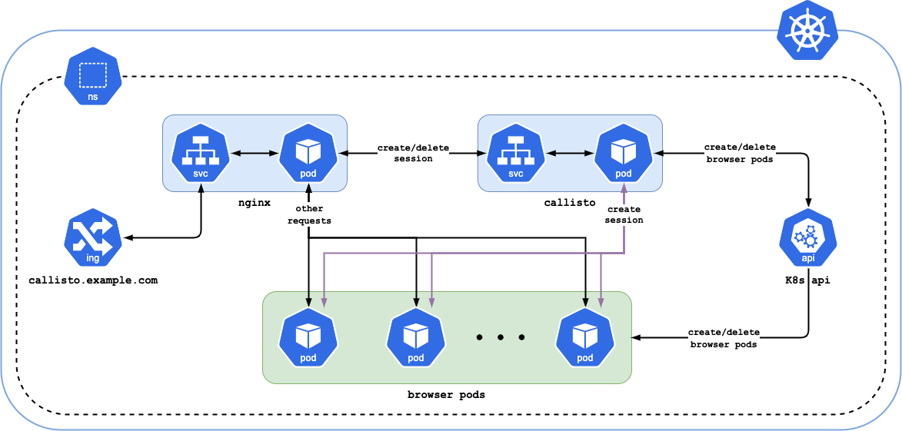

# Callisto
Callisto is an open-source Kubernetes-native implementation of [Selenium Grid](https://en.wikipedia.org/wiki/Selenium_(software)).

## Architecture
#### Callisto architecture

#### Components
* Nginx proxies requests for creating/deleting sessions to Callisto. All other requests are proxied to browser pods directly.
* Callisto creates/deletes browser pods, watches the status of pods, and creates sessions via the webdriver.
* Browser pods contain a webdriver and a browser.

Nginx and Callisto must be running inside a Kubernetes cluster in order to access browser pods directly.

## Features
* No Selenium Grid components used
* Selenoid images can be used
* Selenoid-UI can be used

## Requirements
* Running Kubernetes cluster
* kubectl and helm installed and pointing to the cluster

## Installation
See README.md in helm chart to get started

## Configuration

| Name | Type | Required | Default | Description |
| ---- | ---- | -------- | ------- | ----------- |
| WEB_API_HOST | str | No | 127.0.0.1 | a host to run web api |
| WEB_API_PORT | int | No | 8080 | a port to run web api |
| LOG_LEVEL | str | No | INFO | log level |
| GRAYLOG_HOST | str | No | | Graylog host address. Logging to Graylog is disabled if left empty |
| GRAYLOG_PORT | int | No | 12201 | Graylog port |
| K8S_NAMESPACE | str | No | default | k8s namespace to spawn pods |
| POD_WEBDRIVER_PATH | str | No | | webdriver path location. On selenoid images `/wd/hub` for firefox, empty for others |
| POD_WEBDRIVER_PORT | int | No | 4444 | webdriver port |
| POD_MANIFEST | str | No | /etc/callisto/pod_manifest.yaml | Path to pod manifest file |
| SENTRY_DSN | str | No | | Sentry DSN. Sentry disabled if left empty |

Resources requests/limits, browser image, screen resolution and other parameters can be configured via pod_manifest.yaml.

## Troubleshooting
Each request is marked with a unique trace id (tid). This information is available in the logs. Also, for debugging, it is recommended to set the `LOG_LEVEL` to `DEBUG`.